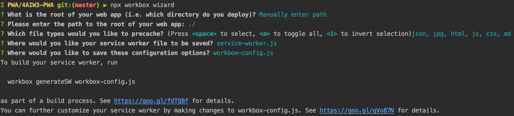

# PWA 

## Mise en cache automatique

Utiliser l'onglet `Application -> Service Workers` de Chrome pour tester le cache 

[workbox documentation](https://developers.google.com/web/tools/workbox/)

### installation

```
npm i -D workbox-cli
npx workbox wizard
```

### paramétrage

```html
<!--index.html-->
<head>
  <!--...-->
  <link rel="manifest" href="manifest.json">
  <!--...-->
  <script>  
    if ('serviceWorker' in navigator) {  
        window.addEventListener('load', function () {  
        navigator.serviceWorker.register("/service-worker.js", {  
          scope: '/'  
        });  
      }) 
    } else {  
      console.log('Use another cache method :(');  
    }
   </script>
 </head>
```

```js
//package.json
{
  //...
  "scripts": {  
    "generate": "npx workbox generateSW",
    //...
  },
  //...
}
```

```js
//workbox-config.js
module.exports = {  
  "globDirectory": "./",  
  "importWorkboxFrom": "local",  
  "globIgnores": [  
      "node_modules/**/*",  
      "package*",  
      "workbox-config.js",  
      "images/**/*"  
  ],
  "runtimeCaching": [{  
    "urlPattern": /\\.(?:png|gif|jpg|jpeg|svg)$/,  
    "handler": "CacheFirst",  
    "options": {  
      "cacheName": "image-cache"  
    }  
  }],
  "globPatterns": [  
    "**/*.{json,jpg,html,js,css}"  
  ],  
  "swDest": "service-worker.js"  
};
```
> Dans ce fichier de configuration il y a plusieurs éléments importants : 
> 
> - `globDirectory` : le dossier à partir duquel on souhaite mettre en cache les fichiers
> - `importWorkboxFrom` : si on spécifie en local, workbox sera télécharger en local
> - `globIgnores` : les fichiers ignorés par workbox
> - `runtimeCaching` : permet de définir un cache dynamique
> - `globPatterns` : les types de fichiers qui vont être cachés
> - `swDest` : le nom du fichier généré après `npx workbox generateSW`


```js
//manifest.json
{  
"name": "News feed",  
"short_name": "News feed",  
"description": "Get all the information you doesn't know you wanted !",  
"icons": [  
  {  
    "src": "images/manifest/icon-192x192.png",  
    "sizes": "192x192",  
    "type": "image/png"  
  },  
  {  
    "src": "images/manifest/icon-512x512.png",  
    "sizes": "512x512",  
    "type": "image/png"  
  }  
],  
"start_url": "/?pwa",  
"display": "standalone",  
"theme_color": "#111111",  
"background_color": "#ffffff"  
}
```


### Run

```
php -S 127.0.0.1:8080
```


## Workbox

[Doc Workbox](https://developers.google.com/web/tools/workbox/)

Workbox sert à utiliser des librairies sans les télécharger.

- Lancer wizard : `$ npx workbox wizard`
- Répondre aux questions : 

- Configurer les dossier à ignorer pour la mise en cache dans le fichier `workbox-config.js`
- run `$ npx workbox generateSW`

## Idb

[Doc Jack Archibald](https://github.com/jakearchibald/idb)

Init : `$  npm i idb`

## Polymer cli

init : `$ npm i -D polymer-cli`
lancer un server : `$ npx polymer serve`

## Lit element

init : `$ npm i lit-elemen`
